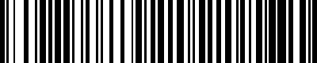
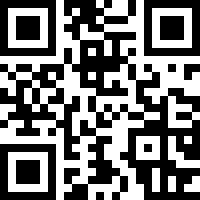

# rubar

A Rust library for barcode encoding and rendering with Python bindings.



## Why rubar?

Most barcode libraries make decisions for you: automatic encoding selection, implicit quiet zones, magic checksum handling. This is convenient until you need precise control—especially for GS1-128 barcodes where FNC1 placement matters, or when you need exact geometry for document layout.

rubar takes a different approach:

- **Exact geometry** — You get module-level bar positions, not opaque images
- **Explicit control** — FNC1, code set selection, quiet zones are all explicit parameters
- **Zero magic** — No automatic anything; you specify exactly what you want

## What rubar does NOT do

- **Layout** — No text labels, no human-readable digits below barcodes
- **Decoding** — Encoding only; use a scanner library for reading
- **Implicit quiet zones** — Add them explicitly if you need them

## Installation

```bash
pip install rubar
```

## Usage

### Code 128

```python
from rubar import Code128, Data

barcode = Code128([Data("HELLO-123")])

# Get the geometry (module positions)
geom = barcode.geometry()
print(f"Total width: {geom.total_modules} modules")
print(f"Number of bars: {len(geom.bars)}")

# Render to SVG (unitless, scales to any size)
svg = barcode.render_svg()

# Render to PNG (exact pixel dimensions)
png = barcode.render_png(400, 100, unit="px")
```

### GS1-128 with FNC1

GS1-128 barcodes require FNC1 immediately after the start symbol. With rubar, this is explicit:

```python
from rubar import Code128, Data, FNC1, StartC

# GS1-128: Application Identifier (01) + GTIN-14
barcode = Code128([
    StartC(),           # Start in Code Set C (numeric pairs)
    FNC1(),             # FNC1 indicates GS1 format
    Data("01"),         # AI: GTIN
    Data("12345678901234"),
])

svg = barcode.render_svg()
```

### QR Code



```python
from rubar import QrCode

qr = QrCode("https://example.com")

# QR geometry is a 2D module grid
geom = qr.geometry()
print(f"QR size: {geom.size}x{geom.size} modules")

svg = qr.render_svg()
png = qr.render_png(200, 200, unit="px")
```

### Other Symbologies

```python
from rubar import Code39, UpcA, Ean8, Itf

code39 = Code39("HELLO")
upc = UpcA("012345678905")      # 12 digits with check digit
ean8 = Ean8("12345670")         # 8 digits with check digit
itf14 = Itf("00012345678905")   # Even-length numeric
```

## Rendering

### SVG: Pure Geometry

`render_svg()` produces a scalable SVG with only a `viewBox`—no `width` or `height` attributes. The viewBox uses module coordinates, so a 95-module barcode has `viewBox="0 0 95 1"`.

```python
svg = barcode.render_svg()
# Embed in HTML/CSS and control size there
```

### PNG: Exact Pixels

`render_png()` requires explicit dimensions. Three unit modes:

```python
# Pixels (direct)
png = barcode.render_png(400, 100, unit="px")

# Inches (requires dpi)
png = barcode.render_png(2.0, 0.5, unit="in", dpi=300)

# Millimeters (requires dpi)
png = barcode.render_png(50.0, 12.0, unit="mm", dpi=300)
```

### Quiet Zones

Quiet zones (empty space around the barcode) are not added by default. Add them explicitly:

```python
svg = barcode.render_svg(quiet_zone_modules=10)
png = barcode.render_png(400, 100, unit="px", quiet_zone_modules=10)
```

## Integration with rupdf

rubar is the barcode engine for [rupdf](https://github.com/anthropics/rupdf), a PDF generation library. While designed for that integration, rubar is fully usable as a standalone library for any barcode generation needs.

## Supported Symbologies

| Symbology | Class | Input |
|-----------|-------|-------|
| Code 128 | `Code128` | List of `Data`, `FNC1`–`FNC4`, `StartA`/`StartB`/`StartC` |
| Code 39 | `Code39` | String (A-Z, 0-9, space, `-.$/%+`) |
| UPC-A | `UpcA` | 11 or 12 digit string |
| EAN-8 | `Ean8` | 7 or 8 digit string |
| ITF | `Itf` | Even-length numeric string |
| QR Code | `QrCode` | Any string |

## License

MIT
